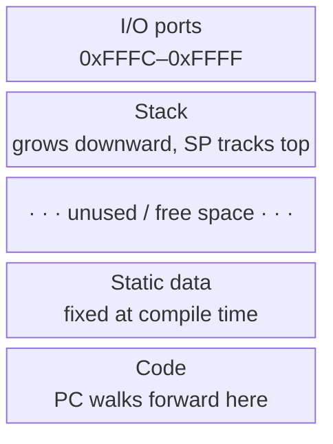

### Instruction Set Architecture

- RISC (Reduced Instruction Set Computing) inspired
- (R) Register
- (I) Immediate
- (B) Branch
- (J) jump

### Word size

- 16-bit

### Type

- Register machine
- Von Neumann architecture

### Registers

- (R0-R7) 8 General
- (FLAGS) Only written by CMP/CMPI — no other instruction touches it, even ones that compute a result
  - (Z) Zero
  - (C) Carry
  - (N) Negative
  - (V) Overflow
- (PC) Program counter
- (SP) Stack pointer

### ALU

- 1 ALU

### SHIFTER

- SHL - Shift left
- SHR - Arithmetic shift right (sign-extends, for signed values)
- SHRU - Logical shift right (zero-fills, for unsigned values)
- allows to move the result x bits left or right
- efficient power of two multiplication and division

### No pipelining, no branch prediction

### Addressing

- refers to words not bytes
- 16 bit addresses

### RAM

- 65,536 addressable words, shared with other usages like external communication interface from [Virtualizaiton](../CPU/Virtualizaiton.md#external-comunication)

### Function calling

- For now arguments are capped at 3 and are all loaded into registers.
